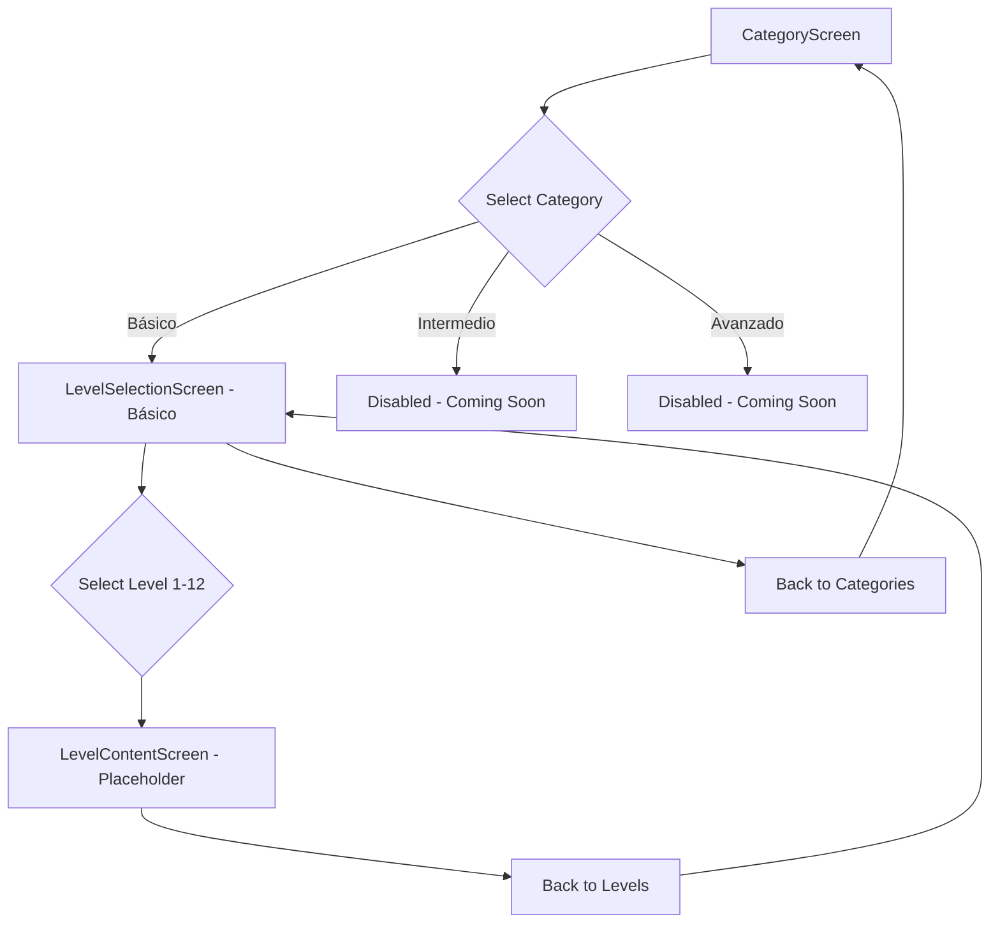

# Plan for Implementing Category-Based Level System

## Current Structure Analysis

- App has screens: home (HomeScreen), lesson, result
- HomeScreen displays units (unit1-unit10) with lessons
- Data: 10 units, each with 2 lessons = 20 lessons total
- Navigation: Home -> Lesson -> Result

## New Structure Requirements

- Main screen: Category selection (Básico, Intermedio, Avanzado)
- Only Básico enabled initially
- Básico: 12 levels (1-12), each with descriptive title
- Intermedio/Avanzado: Disabled with "coming soon" indicator
- Navigation: Main -> Category Levels -> Level Content (placeholder)

## Implementation Plan

### 1. Update Types (src/types/index.ts)

Add new interfaces:

- Category: { id: string, name: string, enabled: boolean, levels: Level[] }
- Level: { id: string, title: string, description?: string, content?: any }

### 2. Create New Components

- CategoryScreen: Replace HomeScreen, show category buttons
- LevelSelectionScreen: Show 12 levels for selected category
- LevelContentScreen: Placeholder screen for level content

### 3. Update App.tsx

- Add new screen states: "categories", "levels", "levelContent"
- Update navigation logic
- Pass category/level data to components

### 4. Modify Data Structure

- Create categoriesData with Básico (12 levels), Intermedio (12 levels, disabled), Avanzado (12 levels, disabled)
- Map existing lessons to Básico levels (first 12 lessons)
- Prepare placeholders for other categories

### 5. Responsive Design & Accessibility

- Use Tailwind CSS classes for responsive layout
- Add ARIA labels, keyboard navigation
- Ensure mobile/desktop compatibility

### 6. Navigation & Transitions

- Smooth transitions using CSS transitions
- Back buttons on level screens
- Update screen state management

### 7. Future Extensibility

- Structure allows easy enabling of Intermedio/Avanzado
- Placeholder content screens ready for implementation

## Data Mapping

- Básico Levels 1-12: Map to existing lessons (unit1l1 to unit6l2, etc.)
- Intermedio/Avanzado: Placeholder levels with "Coming Soon" content

## Component Hierarchy

```
App
├── CategoryScreen (main screen)
├── LevelSelectionScreen (for Básico)
├── LevelContentScreen (placeholder)
├── LessonScreen (existing)
└── ResultScreen (existing)
```

## Navigation Flow Diagram



## Next Steps

Switch to Code mode to implement the above plan.
